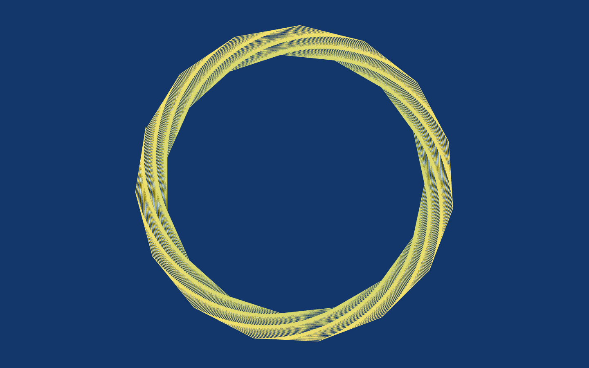
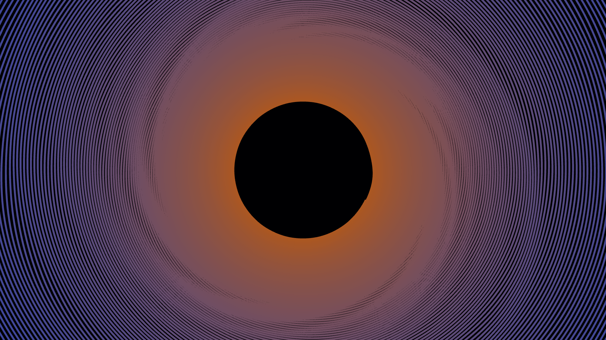
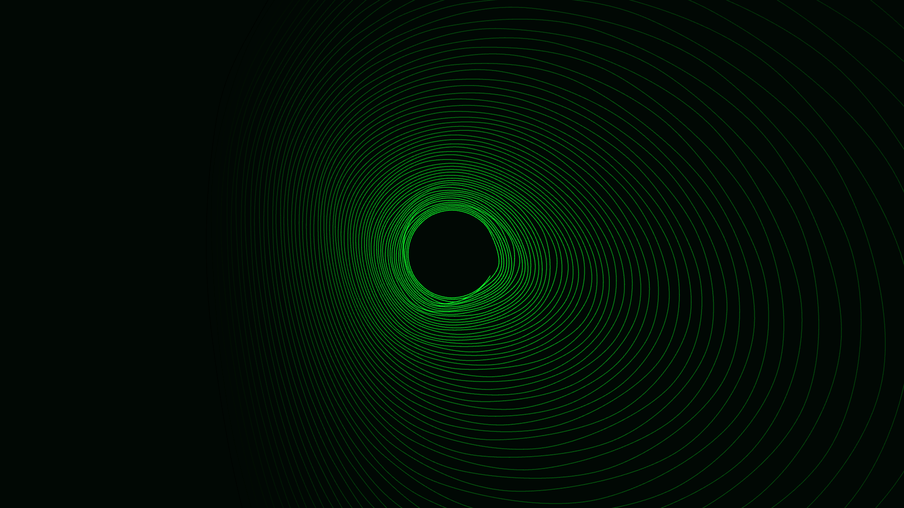
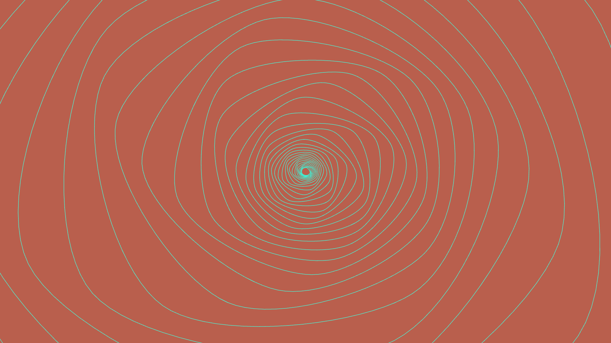
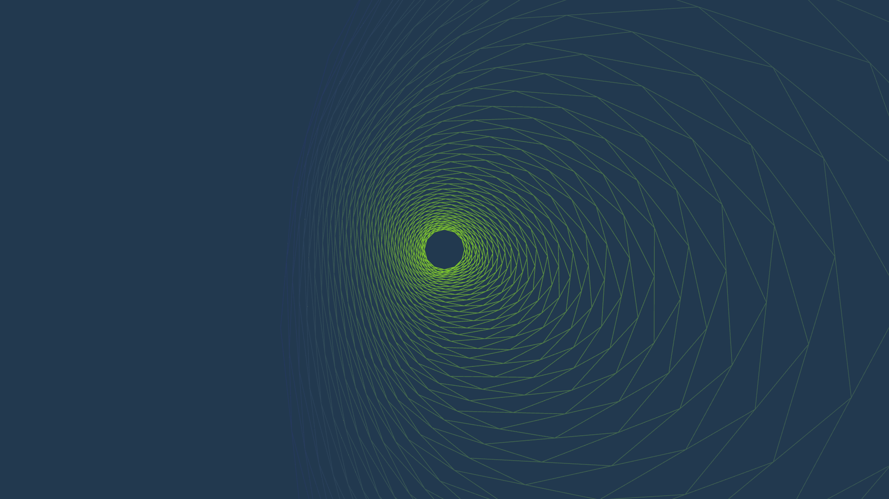
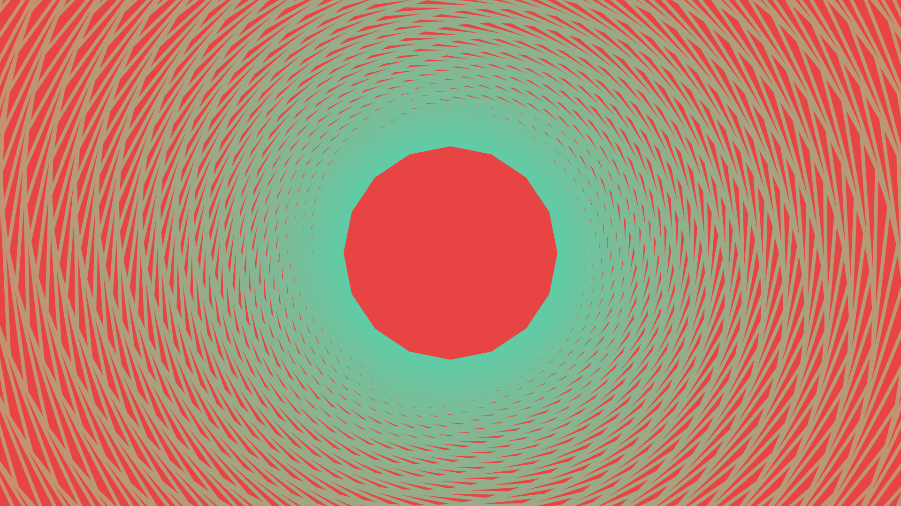

# SPIN Wallpaper generator

## Controls

- ENTER/RETURN - screenshot
- TAB - toggle GUI show/hide
- SHIFT - randomize colors
- ALT - randomize polygon core and building larp fraction
- CONTROL - randomize stroke weight and total size
- UP - randomize all attributes above
- MOUSE WHEEL - zoom

## Examples

